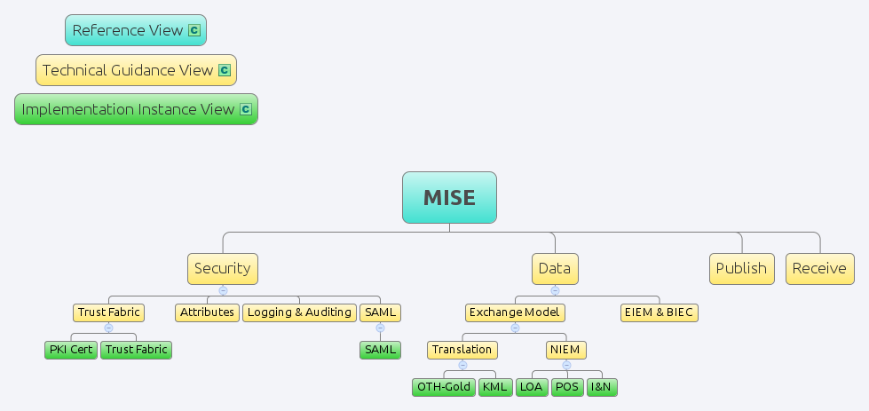

mise-demo
=========

This Maritime Information Sharing Environment (MISE) GitHub site is an
unofficial 3rd party demo. See the [MISE website](https://mise.mda.gov/)
for the official source material.

## General Description

The MISE defines a low cost, implementable solution for maritime information 
sharing while providing mechanisms to mitigate associated legal and policy 
concerns. As a participant in the MISE, data providers and consumers manage 
and share maritime information through common data definitions and security 
attributes, resulting in an internet accessible, unclassified information 
sharing capability.

## Common Profile

The MISE may be understood in terms of a 
"[common profile](http://pi2.ida.org/common-profile)" whereby a single
reference view is expanded on by technical guidance views, each of which may
have sub-views, either providing further technical guidance or details about
specific implementations:

The [Security](https://github.com/ida-org/mise-demo/blob/master/security-services-interfacing.md) and Data Technical 
Guidance views, along with their various subviews, define the exchange data 
formats as well as the security requirements for successful data exchange. For
example, [SAML](https://en.wikipedia.org/wiki/Security_Assertion_Markup_Language)
is to be used to exchange authentication and authorization information, and 
[SSL](https://en.wikipedia.org/wiki/Transport_Layer_Security) is to be used to
provide confidentiality as well as machine-to-machine authentication.

This GitHub project shares some of the implementation-level code. The 
"Implementation View Plumbing" refers to code that implements TG view
requirements like the ones mentioned above. The "Client Sample Code" shows how
to access the [publish service](https://github.com/ida-org/mise-demo/blob/master/publish-spec.md) 
(including deleting position records) and the 
[search and retrieve services](https://mise.mda.gov/drupal/node/106).

| Implementation | Implementation View Plumbing | Client Sample Code|
| ---------------|------------------------------|-------------------|
| [Java](https://github.com/ida-org/mise-demo/tree/master/MDA-clients/java) | source and binary jar files - <code>MDA-clients/java/MDAUtils-1.0-*.jar</code>† | [MDA-clients/java/src/test](https://github.com/ida-org/mise-demo/tree/master/MDA-clients/java/src/test) |
| [.Net (C#)](https://github.com/ida-org/mise-demo/tree/master/MDA-clients/dotnet) | [MDA-clients/dotnet/MdaToolkit] (https://github.com/ida-org/mise-demo/tree/master/MDA-clients/dotnet/MdaToolkit) | [MDA-clients/dotnet/ClientTest/ClientTest.cs](https://github.com/ida-org/mise-demo/blob/master/MDA-clients/dotnet/ClientTest/ClientTest.cs) |

† The jar files must be accessed by downloading the zip file below, or by
cloning this repository.

## Downloads

* [GitHub ZIP](https://github.com/ida-org/mise-demo/archive/master.zip)
* [Official Packages](https://mise.mda.gov/drupal/tools)
