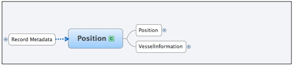

 <h1 class="with-tabs">Data Mapping</h1>

<h2>Obtain the Latest NIEM-M Models</h2>

The NIEM-M Maritime Domain Awareness (MDA) Enterprise Information Exchange Model (EIEM) and Information Exchange Package Documentation (IEPD) are registered and available for download from the <a href="http://www.it.ojp.gov/framesets/iepd-clearinghouse-noClose.htm">NIEM IEPD Clearinghouse</a> and the DoD Metadata Registry.  

Download the IEPDs:

<ul><li><a href="https://mise.mda.gov/drupal/sites/default/files/mda-3.2.eiem_.zip">MDA Enterprise Information Exchange Model (EIEM)</a></li>
<li><a href="../position-3.2.iepd">Vessel Position IEPD</a></li>
<li><a href="https://mise.mda.gov/drupal/sites/default/files/ian-3.2.iepd_.zip">Indicators and Notifications IEPD</a></li>
<li><a href="https://mise.mda.gov/drupal/sites/default/files/noa-3.2.iepd_.zip">Notice of Arrival IEPD</a></li>
<li><a href="https://mise.mda.gov/drupal/sites/default/files/loa-3.2.iepd_.zip">Levels of Awareness IEPD</a></li>
<li><a href="https://mise.mda.gov/drupal/sites/default/files/vinfo-3.2.iepd_.zip">Vessel Information IEPD</a></li>
</ul>

<h2>How to Map Data to NIEM Maritime</h2>

Suppose the following is a native vessel position report format.  Data elements include ship's identification, GPS position, course, speed, navigational status, and time-stamp.  A sample XML syntax is included below. 

<pre class="brush: xml">

&lt;Track&gt;
	&lt;DateTime&gt;2011-01-13T13:17:02.325Z&lt;/DateTime&gt;
	&lt;CountryMID&gt;303&lt;/CountryMID&gt;
	&lt;RegionID&gt;27&lt;/RegionID&gt;
	&lt;TrackInfo&gt;
		&lt;TrackInfoVessel&gt;
			&lt;VesselId&gt;
				&lt;MMSI&gt;367354000&lt;/MMSI&gt;
			&lt;/VesselId&gt;
			&lt;VesselAIS&gt;
				&lt;VesselDataDynamic&gt;
					&lt;Coordinate&gt;
						&lt;LAT&gt;53.8782833&lt;/LAT&gt;
						&lt;LON&gt;-166.538633&lt;/LON&gt;
					&lt;/Coordinate&gt;
					&lt;COG&gt;178&lt;/COG&gt;
					&lt;SOG&gt;0.1&lt;/SOG&gt;
					&lt;HDT&gt;228&lt;/HDT&gt;
					&lt;ROT&gt;0&lt;/ROT&gt;
					&lt;NavStatus&gt;Engine&lt;/NavStatus&gt;
					&lt;PosAcc&gt;Low&lt;/PosAcc&gt;
				&lt;/VesselDataDynamic&gt;
			&lt;/VesselAIS&gt;
		&lt;/TrackInfoVessel&gt;
	&lt;/TrackInfo&gt;
&lt;/Track&gt;
</pre>

As depicted in the logical diagram for the Position IEPD, Position and Vessel Information are the two primary logical blocks included in a position report.  Record Metadata is included in every message type.

The first step is to use the Mapping Spreadsheet from the IEPD.  In this example, we are translating a track message into the NIEM format so we will be using the <a href="http://niem.gtri.gatech.edu/niemtools/iepd/display/container.iepd?ref=KpOEKUaWqZE">Position IEPD</a>.  Find and open the component mapping spreadsheet.

The mapping spreadsheet provides the path for each element in the XML.  Each tab corresponds to a "block" in the logical diagram.

An example of the Mapping Spreadsheet is captured below:

Use the Position tab of the Mapping spreadsheet to determine the xml elements to represent the position data in the position message type.  For the example message the position is represented as follows:

<pre class="brush: xml">
&lt;mda:Position&gt;
	&lt;m:LocationPoint&gt;
		&lt;gml:Point gml:id="tp1"&gt;
			&lt;gml:pos&gt;53.8782833 -166.538633&lt;/gml:pos&gt;
		&lt;/gml:Point&gt;
	&lt;/m:LocationPoint&gt;
	&lt;mda:PositionSpeedMeasure&gt;
		&lt;nc:MeasureText&gt;0.1&lt;/nc:MeasureText&gt;
		&lt;nc:SpeedUnitCode&gt;kt&lt;/nc:SpeedUnitCode&gt;
	&lt;/mda:PositionSpeedMeasure&gt;
	&lt;mda:PositionCourseMeasure&gt;
		&lt;nc:MeasureText&gt;178&lt;/nc:MeasureText&gt;
		&lt;m:AngleUnitText&gt;deg&lt;/m:AngleUnitText&gt;
	&lt;/mda:PositionCourseMeasure&gt;
	&lt;mda:PositionHeadingMeasure&gt;
		&lt;nc:MeasureText&gt;228&lt;/nc:MeasureText&gt;
		&lt;m:AngleUnitText&gt;deg&lt;/m:AngleUnitText&gt;
	&lt;/mda:PositionHeadingMeasure&gt;
	&lt;mda:PositionNavigationStatus&gt;
		&lt;nc:StatusText&gt;Engine&lt;/nc:StatusText&gt;
	&lt;/mda:PositionNavigationStatus&gt;
	&lt;mda:PositionDateTime&gt;
		&lt;nc:DateTime&gt;2011-01-13T13:17:02.325Z&lt;/nc:DateTime&gt;
	&lt;/mda:PositionDateTime&gt;
&lt;/mda:Position&gt;
</pre>

If an element does not map to the NIEM format, it can be included in the expansion text if desired.

To complete the message, we used the Vessel Information tab of the Mapping Spreadsheet to complete translation.  Vessel is represented as follows:

<pre class="brush: xml">
&lt;mda:Vessel&gt;
	&lt;m:VesselAugmentation&gt;
		&lt;m:VesselMMSIText&gt;367354000&lt;/m:VesselMMSIText&gt;
	&lt;/m:VesselAugmentation&gt;
&lt;/mda:Vessel&gt;

</pre>

Below is the full NIEM conformant Position Message.  

<pre class="brush: xml">
&lt;?xml version="1.0" encoding="UTF-8"?&gt;
&lt;!--Sample Position instance corresponding to the Position version 3.2 IEPD --&gt;
&lt;posex:Message
	xsi:schemaLocation="http://niem.gov/niem/domains/maritime/2.1/position/exchange/3.2 ../XMLSchemas/exchange/3.2/position-exchange.xsd"
	xmlns:m="http://niem.gov/niem/domains/maritime/2.1" xmlns:mda="http://niem.gov/niem/domains/maritime/2.1/mda/3.2"
	xmlns:posex="http://niem.gov/niem/domains/maritime/2.1/position/exchange/3.2"
	xmlns:nc="http://niem.gov/niem/niem-core/2.0" xmlns:gml="http://www.opengis.net/gml/3.2"
	xmlns:ism="urn:us:gov:ic:ism" xmlns:xsi="http://www.w3.org/2001/XMLSchema-instance"
	mda:securityIndicatorText="LEI" mda:releasableNationsCode="USA"
	mda:releasableIndicator="true"&gt;
	&lt;nc:DocumentCreationDate&gt;
		&lt;nc:Date&gt;2011-12-01&lt;/nc:Date&gt;
	&lt;/nc:DocumentCreationDate&gt;
	&lt;nc:DocumentExpirationDate&gt;
		&lt;nc:Date&gt;2012-01-01&lt;/nc:Date&gt;
	&lt;/nc:DocumentExpirationDate&gt;
	&lt;nc:DocumentCreator&gt;
		&lt;nc:EntityOrganization&gt;
			&lt;nc:OrganizationName&gt;Example Organization&lt;/nc:OrganizationName&gt;
		&lt;/nc:EntityOrganization&gt;
	&lt;/nc:DocumentCreator&gt;
	&lt;mda:RecordIDURI&gt;00000001&lt;/mda:RecordIDURI&gt;
	&lt;mda:MessageStatusCode&gt;Initial&lt;/mda:MessageStatusCode&gt;
	&lt;mda:MessageSourceSystemName&gt;Track Source&lt;/mda:MessageSourceSystemName&gt;
	&lt;mda:ICISMMarkings ism:classification="U"
		ism:ownerProducer="USA" /&gt;
	&lt;mda:Vessel&gt;
		&lt;m:VesselAugmentation&gt;
			&lt;m:VesselMMSIText&gt;367354000&lt;/m:VesselMMSIText&gt;
		&lt;/m:VesselAugmentation&gt;
	&lt;/mda:Vessel&gt;
	&lt;mda:Position&gt;
		&lt;m:LocationPoint&gt;
			&lt;gml:Point gml:id="tp1"&gt;
				&lt;gml:pos&gt;53.8782833 -166.538633&lt;/gml:pos&gt;
			&lt;/gml:Point&gt;
		&lt;/m:LocationPoint&gt;
		&lt;mda:PositionSpeedMeasure&gt;
			&lt;nc:MeasureText&gt;0.1&lt;/nc:MeasureText&gt;
			&lt;nc:SpeedUnitCode&gt;kt&lt;/nc:SpeedUnitCode&gt;
		&lt;/mda:PositionSpeedMeasure&gt;
		&lt;mda:PositionCourseMeasure&gt;
			&lt;nc:MeasureText&gt;178&lt;/nc:MeasureText&gt;
			&lt;m:AngleUnitText&gt;deg&lt;/m:AngleUnitText&gt;
		&lt;/mda:PositionCourseMeasure&gt;
		&lt;mda:PositionHeadingMeasure&gt;
			&lt;nc:MeasureText&gt;228&lt;/nc:MeasureText&gt;
			&lt;m:AngleUnitText&gt;deg&lt;/m:AngleUnitText&gt;
		&lt;/mda:PositionHeadingMeasure&gt;
		&lt;mda:PositionNavigationStatus&gt;
			&lt;nc:StatusText&gt;Engine&lt;/nc:StatusText&gt;
		&lt;/mda:PositionNavigationStatus&gt;
		&lt;mda:PositionDateTime&gt;
			&lt;nc:DateTime&gt;2011-01-13T13:17:02.325Z&lt;/nc:DateTime&gt;
		&lt;/mda:PositionDateTime&gt;
	&lt;/mda:Position&gt;
&lt;/posex:Message&gt;
</pre>