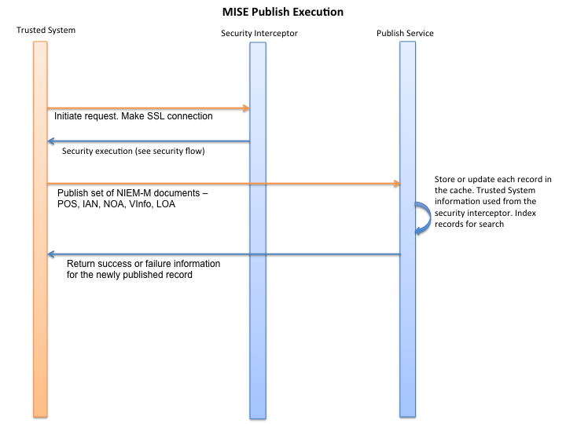
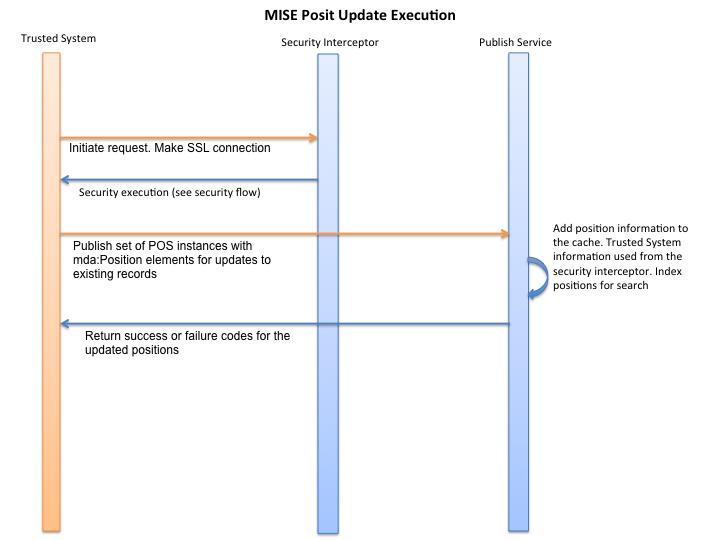

<h1 class="with-tabs">Process Flows for Security, Publish/Update, Delete, and Search/Retrieve</h1>

This section shows graphical representations of the major data provider and data consumer interactions with the MISE services. 

<h2>Security</h2>

<h2>Publish/Update</h2>

<h2>Position Update</h2>

<h2>Delete</h2>

<h2>Search and Retrieve</h2>

