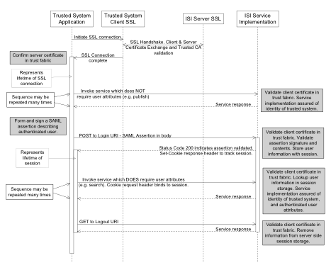

<h1 class="with-tabs">MISE Interface Security Specification</h1>

The Maritime Information Share Environment (MISE) specifications for services such as Publication, Search, and Retrieval define Representational State Transfer (RESTful) interfaces specific to each service, but do not discuss specifics regarding how those interfaces are secured, how identity of the trusted system invoking the service is guaranteed, or how authenticated user attributes are delivered when applicable. The purpose of this specification is to discuss these aspects, which apply to all MISE services, and augment each RESTful interface defined in separate specifications. In addition, sample code demonstrating many aspects of MISE interface security is available at <a href="https://mise.mda.gov">https://mise.mda.gov</a>. 
The Security Architecture View section of the National Maritime Architecture Framework should be reviewed prior to reading this specification, as it provides important overview and context to the material presented here. This specification does not repeat that overview and context information, but assumes the reader is familiar with it. 
The design of MISE interface security has followed a number of patterns used in the U.S. Department of Justice’s Global Federated Identity and Privilege Management (GFIPM) . There are some fundamental architectural differences between GFIPM and the MISE, which impact the design. Key among these are:

<ul><li>MISE uses a hub and spoke network topology whereas GFIPM uses a point-to-point topology.
</li><li>MISE uses RESTful service interfaces whereas GFIPM uses Simple Object Access Protocol (SOAP)-based interfaces.
</li></ul>
Despite these differences, there is a strong relationship between MISE and GFIPM. Portions of GFIPM documents are therefore incorporated into this document and modified to fit the MISE. In particular, [GFIPM Trust] and [GFIPM Services] were referenced in creation of this specification.

<h3>References</h3>
<table><tr><td>RFC 2119
</td><td>“RFC 2119—Key Words for Use in RFCs to Indicate Requirement Levels” 
Internet RFC/STD/FYI/BCP Archives <a href="http://www.ietf.org/rfc/rfc2119.txt">http://www.ietf.org/rfc/rfc2119.txt</a>
</td></tr><tr><td>GFIPM Trust
</td><td>Federated Identity and Privilege Management (GFIPM): Cryptographic Trust Model <a href="http://www.it.ojp.gov/gist/Document/73">http://www.it.ojp.gov/gist/Document/73</a>
</td></tr><tr><td>GFIPM Services
</td><td>Federated Identity and Privilege Management (GFIPM): Web Services System-to-System Profile <a href="http://www.it.ojp.gov/gist/Document/122">http://www.it.ojp.gov/gist/Document/122</a>
</td></tr><tr><td>SAML2 Metadata
</td><td>“Metadata for the OASIS Security Markup Language (SAML) V2.0” 
OASIS Standard, 15 March 2005 
Document Identifier: saml-metadata-2.0-os <a href="http://docs.oasis-open.org/security/saml/v2.0/saml-metadata-2.0-os.pdf">http://docs.oasis-open.org/security/saml/v2.0/saml-metadata-2.0-os.pdf</a>
</td></tr><tr><td>SAML2 Core
</td><td>“Assertions and Protocol for the OASIS Security Markup Language (SAML) V2.0” 
OASIS Standard, 15 March 2005 
Document Identifier: saml-core-2.0-os <a href="http://docs.oasis-open.org/security/saml/v2.0/saml-core-2.0-os.pdf">http://docs.oasis-open.org/security/saml/v2.0/saml-core-2.0-os.pdf</a>
</td></tr><tr><td>NIST SP 800-52
</td><td>Guidelines for the Selection and Use of Transport Layer Security (TLS) Implementations 
National Institute of Science and Technology (NIST) Special Publication 800-52 <a href="http://csrc.nist.gov/publications/nistpubs/800-52/SP800-52.pdf">http://csrc.nist.gov/publications/nistpubs/800-52/SP800-52.pdf</a> </td></tr></table><h3>Document Structure</h3>

Section 2 below describes details regarding key aspects of MISE interface security introduced in the Security Architecture View section of the National Maritime Architecture Framework. 
Section 3 presents details of the Trust Fabric document. 
Section 4 presents details of the Security Assertions Markup Language (SAML) assertions.

<h2>Process Flow and Processing Rules</h2>

This section discusses details regarding key aspects of MISE interface security, including the purpose of each as well as important implementation and operational requirements. The figure below illustrates these key aspects, and will be referenced throughout this section.

 
Figure 1 - Service Invocation Process Flow

<h3>X.509 Certificates and Private Keys</h3>

X.509 certificates and associated private keys are used for several purposes in MISE interface security. Specifically:

<ul><li>Signing the trust fabric document by the MISE Certificate Authority (CA).
</li><li>Signing Security Assertions Markup Language (SAML) assertions (which contain user attributes) by information consumer systems.
</li><li>Client and server certificates for securing Secure Sockets Layer (SSL) connections between trusted systems and the MISE.
</li></ul><h4>Public / Private Key Pair</h4>

The process of creating an X.509 certificate begins with generating a pair of keys that are mathematically related - a public key and a private key. One key locks or encrypts data, and the other unlocks or decrypts the data. Neither key can perform both functions by itself.  The private key, as its name implies, must be kept secure. The public key is included inside the X.509 certificate, and must be available to any entity needing to engage in secure interaction with the possessor of the private key. 
To be used in the MISE, all generated key pairs must be 2048-bit RSA  keys. 
More detail regarding each usage of X.509 certificates in MISE interface security is provided in subsequent sections of this document. For each usage, this table shows which system has access to the private key, and how the corresponding X.509 certificate is distributed. The rightmost column (certificate signing) is discussed in the next section.

<table><tr><th>Use
</th><th>Private Key
</th><th>X.509 Certificate Distribution
</th><th>X.509 Certificate Signing
</th></tr><tr><td>Signing trust fabric document
</td><td>MISE Management
</td><td>Provided to each trusted system during on-boarding process.
</td><td>MISE CA
</td></tr><tr><td>Signing SAML assertions
</td><td>Information consumer system which asserts user attributes
</td><td>Included in trust fabric
</td><td>Any well-known root CA
</td></tr><tr><td>MISE SSL server certificate
</td><td>MISE
</td><td>Included in trust fabric
</td><td>Any well-known root CA
</td></tr><tr><td>Trusted system SSL client certificate
</td><td>Trusted system
</td><td>Included in trust fabric
</td><td>	Any well-known root CA
</td></tr></table><h4>MISE Certificate Authority (CA)</h4>

The MISE Management operates a certificate authority (CA) to provide trust and security to the environment. The sole purpose of this CA is to sign the Trust Fabric. The CA does not issue certificates to trusted systems. Trust in the MISE is anchored by the Trust Fabric document and the MISE CA’s signature of the document.

<h4>X.509 Certificates</h4>

Before a keypair can be used in the MISE for secure interaction, an X.509 certificate must be created containing the public key. An X.509 certificate binds a name to a public key value. The role of the certificate is to associate a public key with the identity contained in the X.509 certificate. All certificates must be digitally signed by a CA. A CA is a trusted entity that confirms the integrity of the public key value in a certificate. To be used in the MISE, an X.509 certificate must be signed by a well-known root certificate authority . Any root CA trusted by all major browsers is acceptable.

<h5>Creating X.509 Certificates</h5>

Numerous tools and processes are available for creating key pairs and X.509 certificates. The exact process chosen by a trusted system will vary depending on the platform the trusted system implementation is based upon, agency procedures, and the chosen root CA. 
In some cases a trusted system will choose to generate a keypair and a certificate signing request (CSR) internally using a tool such as OpenSSL  or Java’s keytool, and submit the CSR to the root CA for signing. In other cases, a trusted system may choose to use tools provided by the root CA for generation of the keypair in addition to signing the certificate.  For step-by-step instructions, see the Implementation Guide at <a href="https://mise.mda.gov">https://mise.mda.gov</a>.

<h3>SSL Connections
</h3>
All MISE service invocations must take place over SSL network connections. Both server and client SSL certificates are required. The top portion of Figure 1 illustrates establishing an SSL connection. 
The following requirements are standard with SSL connections, and are part of any SSL implementation:

<ul><li>The client side must validate the signature of the certificate presented by the server, confirm that it was signed by a root CA trusted by the client, and confirm that the server proves possession of the private key associated with the certificate.
</li><li>The client side must validate that the Subject common name (CN) within the server certificate matches the domain name portion of the service Uniform Resource Locator (URL) endpoint.
</li><li>The server side must validate the signature of the certificate presented by the client, confirm that it was signed by a root CA trusted by the server, and confirm the client proves possession of the private key associated with the certificate.
</li></ul>
Beyond these standard SSL requirements, the MISE requires:

<ul><li>Each side of the SSL connection must confirm that the certificate presented by the opposite side exists within a RoleDescriptor element of the Trust Fabric, and must have used=”signing” on the KeyDescriptor. (Details of Trust Fabric document format are presented in section 3.1.)
</li><li>SSL v3 or Transport Layer Security (TLS) 1.1 (and higher) must be used. TLS 1.2 is recommended. In addition, it is recommended that the TLS implementation conform to [NIST SP 800-52].
</li></ul>
Taken together, these requirements guarantee a secure point-to-point communication channel between the client (trusted system) and server (MISE). In addition each side knows the identity of the other side, knows the other side is a current approved member of the MISE, and has all metadata in the trust fabric about the other side available to it. 
SSL connections are typically reused for a series of service invocations (the process flow illustrates this reuse).  There is no requirement that a related series of service invocations take place over the same SSL connection; however, there is a requirement that the verification steps enumerated above be confirmed each time a new connection is established.

<h3>SAML Assertion Processing</h3>

As illustrated in the lower portion of Figure 1, some MISE service invocations (e.g. Search, Retrieval) are done on behalf of an individual user, or a set of users with identical user attributes. In these cases, authenticated user attributes must be available to the service. 
When user attributes are required, they are delivered using SAML assertions. In SAML terms, information consumer systems act as identity providers. Prior to invoking services on behalf of users, an information consumer system creates a SAML assertion in accordance with the guidelines specified in section 4.1 below. This SAML assertion contains authenticated user attributes pertaining to the user or group of users who will be granted access to the information obtained from the subsequent series of service invocations. The assertion is then digitally signed by the information consumer system using the private key associated with the signing certificate, which is a part of its MISEConsumerDescriptor (see section 3.1.3.2) role information within the trust fabric document.  This provides a cryptographic guarantee to the MISE, and to information provider systems, of the identity of the information consumer system asserting the user attributes and promising to handle the information in accordance with MISE guidelines. 
Rather than sending the SAML assertion with each service invocation, assertions are sent once at the beginning of a series of service invocations on behalf of a user or group of users. There is significant overhead associated with delivering the SAML assertion, cryptographically validating the digital signature, and validating the contents of the assertion document. Sending the assertion once to apply to a series of service invocations reduces the overall impact of this overhead. In addition, this pattern allows service interfaces to be fully RESTful. Request and response message bodies simply contain information associated with the service, without each interface needing to accommodate inclusion of a SAML assertion document. 
Figure 1 above illustrates the pattern used to allow a single SAML assertion to be bound to multiple service invocations. Key points related to this pattern include:

<ul><li>Some MISE services require user attributes, which are delivered in signed SAML assertions. Other services do not require user attributes. Whether or not a specific service requires user attributes is specified in the individual service documentation. If a service that requires user attributes is invoked without associating a SAML assertion, the service will return an HTTP status code of 403 (Forbidden) and a MISE error code of 104 (SAML assertion required but missing)(see section 2.4.1).
</li><li>All service invocations, including the Login and Logout services, must occur over SSL connections validated against the trust fabric, with the identity of the invoking trusted system guaranteed as described in section 2.2 above.
</li><li>Before invoking a service that requires user attributes, an information consumer system must create a SAML assertion and send it to the MISE using the Login service specified in section 2.3.1 below. The login service performs full validation of the assertion signature and contents, and creates a session context for subsequent service invocations to reference. The session key is returned to the information consumer system in a Set-Cookie HTTP response header.
</li><li>The information consumer system may then proceed with any number of MISE service invocations on behalf of the user or group of users as asserted with the SAML assertion. Each of these service invocations MUST include a Cookie HTTP request header whose value is the session key set by the Login request. The information consumer system has the responsibility to ensure that information retrieved from the MISE will only be made available to users described in the SAML assertion.
</li><li>Sessions and SAML assertions both have a defined lifetime. If a client sends a session key referencing a session which has expired, the MISE interface security implementation will not deliver user attributes to the service implementation; which means the error response the trusted system will see is the same as if a session key had not been sent. Specifically this will be an HTTP status code of 403 (Forbidden) and a MISE error code of 104 (SAML assertion required but missing)(see section 2.4.1). The client trusted system should respond to this error condition by invoking the login service again with a valid SAML assertion, then re-invoking the failed service request with the new session cookie returned by the login service.
</li><li>Sessions expire after 20 minutes of inactivity. Any service invocation referencing the session resets this 20-minute timer. In addition, it is recommended that trusted systems invoke the Logout service (see section 0) if the trusted system is able to determine that the session will no longer be used. This allows the MISE to free resources used to store the session information prior to the 20-minute automatic expiration period.
</li><li>SAML assertions expire when outside the time window expressed in the NotBefore and NotOnOrAfter attributes of the <conditions> element. MISE sessions automatically expire when outside this time window, separately from the 20-minute inactivity timer.
<li>An information consumer system will commonly serve many simultaneous users, and thus will commonly have many simultaneous open sessions with the MISE. It is the responsibility of the information consumer system to ensure that the correct session key is used when invoking services on behalf of a given user or group of users.
</li><li>Figure 1 shows a series of service invocations operating in the context of a single SSL connection for simplicity of illustration; however this is not a requirement.  Information consumer systems should keep SSL connection(s) to the MISE open during active communication to enhance performance by avoiding the overhead of establishing a fresh SSL connection for each service invocation. However, there is no requirement that all service invocations for a given session occur over the same SSL connection. In addition, service invocations for multiple sessions may take place over a single SSL connection. It IS REQUIRED that full SSL certificate validation back to the trust fabric take place every time a fresh SSL connection is established, so if a connection pooling system is used, trust fabric validation must be integrated with the connection pool.
</li></conditions></li></ul><h4>Login Service Interface</h4>
<table><tr><th>URI
</th><th>From MISELoginService element in MISEInfrastructureDescriptor role in trust fabric.
</th><th>Example: <a href="https://mda.gov/services/login">https://mda.gov/services/login</a>
</th></tr><tr><td>Method
</td><td>POST
</td><td>
</td></tr><tr><td>Request Headers
</td><td>
</td><td>	None specified
</td></tr><tr><td>Request Content Type
</td><td>application/xml
</td><td>
</td></tr><tr><td>Request Content
</td><td>Signed SAML Assertion
</td><td>

</td></tr><tr><td>Status Codes
</td><td>200 (OK)
</td><td>Successful. Response content as described below.
</td></tr><tr><td>
</td><td>Other values
</td><td>If error conditions are encountered, the response will be in accordance with section 0 below.
</td></tr><tr><td>Response Headers
</td><td> Set-Cookie: MISESession=xxxxxxxx; Path=/
</td><td>“xxxxxxxx” will be replaced by a randomly-generated value unique to the session.
</td></tr><tr><td>Response Content
</td><td>
</td><td>	Empty </td></tr></table><h4>Logout Service Interface</h4>
<table><tr><td>URI
</td><td> From MISELogoutService element in MISEInfrastructureDescriptor role in trust fabric.
</td><td>Example: <a href="https://mda.gov/services/logout">https://mda.gov/services/logout</a>
</td></tr><tr><td>Method
</td><td> GET
</td><td>
</td></tr><tr><td>Request Headers
</td><td> Cookie: MISESession=xxxxxxxx
</td><td>“xxxxxxxx” is the key of the session to terminate, previously returned from Login service.
</td></tr><tr><td>Request Content
</td><td>
</td><td>	Empty

</td></tr><tr><td>Status Codes
</td><td>200 (OK)
</td><td>Successful. Response content as described below.
</td></tr><tr><td>
</td><td>	Other values
</td><td>	If error conditions are encountered, the response will be in accordance with section 0 below.
</td></tr><tr><td>Response Headers
</td><td>
</td><td>	None specified
</td></tr><tr><td>Response Content
</td><td>
</td><td>	Empty </td></tr></table><h3>MISE Error Response Content</h3>

MISE service invocations which result in HTTP status codes in the 4xx (Client Error) and 5xx (Server Error) ranges may return an XML document as the response content providing additional details about the error encountered.  The HTTP status is the important code to determine the server response, and the response content is provided only for debugging purposes. When such an error response document is returned, the response Content-Type is application/xml, and the response document is in the following format:

<pre class="brush:xml">
<miseerror><code>100</code>
	<description>Client certificate not presented during SSL handshake</description></miseerror></pre><h4>	MISE Error Codes for Interface Security</h4>

Table 4 lists MISE error codes relevant to interface security, which pertain to all MISE services. Additional service-specific error codes may be defined in individual service specification documents.

<table><tr><th>MISE Error Code
</th><th>HTTP Status Code Returned
</th><th>Error Description
</th></tr><tr><td>100
</td><td>403
</td><td>Client certificate not presented during SSL handshake
</td></tr><tr><td>101
</td><td>500
</td><td>Internal server error accessing trust fabric
</td></tr><tr><td>102
</td><td>403
</td><td>Client certificate not found in trust fabric
</td></tr><tr><td>103
</td><td>403
</td><td>Session cookie not associated with trusted system
</td></tr><tr><td>104
</td><td>403
</td><td>SAML assertion required but missing
</td></tr><tr><td>201
</td><td>400
</td><td>SAML assertion signature validation failed
</td></tr><tr><td>202
</td><td>403
</td><td>SAML signing certificate not in trust fabric
</td></tr><tr><td>203
</td><td>403
</td><td>SAML signing certificate not associated with trusted system
</td></tr><tr><td>204
</td><td>400
</td><td>SAML assertion issued by different entity than sender
</td></tr><tr><td>205
</td><td>400
</td><td>MISE SAML assertions MUST NOT include a Subject
</td></tr><tr><td>206
</td><td>400
</td><td>MISE SAML assertions MUST NOT include AuthnStatement
</td></tr><tr><td>207
</td><td>400
</td><td>MISE SAML assertions MUST include Conditions element
</td></tr><tr><td>208
</td><td>400
</td><td>NotBefore condition of assertion failed
</td></tr><tr><td>209
</td><td>400
</td><td>NotOnOrAfter condition of assertion failed
</td></tr><tr><td>210
</td><td>400
</td><td>MISE SAML assertions MUST include single AudienceRestriction element
</td></tr><tr><td>211
</td><td>400
</td><td>MISE SAML assertions MUST include AudienceRestriction of 'urn:mise:all'
</td></tr><tr><td>212
</td><td>403
</td><td>User attribute ‘ <formalname>’ disallowed by trust fabric
<tr><td>213
</td><td>403
</td><td>Asserting trusted system is not an information consumer system
</td></tr><tr><td>299
</td><td>500
</td><td>Internal server error processing SAML assertion </td></tr></formalname></td></tr></table>
Table 4 - MISE Interface Security Error Codes

<h3>Trust Fabric Lifecycle Management Procedures</h3>

This section describes policies and procedures used to manage the MISE Cryptographic Trust Fabric. It includes details about how the Trust Fabric is created and distributed, as well as the conditions under which the Trust Fabric is updated.

<h4>Trust Fabric Creation Procedure</h4>

Upon occurrence of a triggering condition for a Trust Fabric update (see section 2.5.3), the Trust Fabric must be regenerated. The process of generating a new Trust Fabric document consists of two basic operations: editing the document to reflect the desired policy change (e.g., new trusted system added to the environment) and digitally signing the new document with the MISE CA private key. The following steps describe the process in more detail.

<ol><li>Starting with the most recent Trust Fabric document, edit the document as needed to incorporate the necessary changes.
</li><li>Copy the edited Trust Fabric document to removable media.
</li><li>Connect the removable media containing the unsigned Trust Fabric document to the physical machine on which the signing operation will be performed. Also connect the removable media containing the CA private key to the machine.
</li><li>Perform the cryptographic signing operation on the Trust Fabric document using the CA private key. At no point during this operation shall the CA private key be copied from the removable media onto any other storage device. Also, at no point during this operation shall the physical machine be connected to a network.
</li><li>Copy the signed Trust Fabric document onto the removable media that contains the unsigned Trust Fabric document.
</li></ol><h4>Trust Fabric Distribution Procedure</h4>

Upon the occurrence of a triggering condition for a Trust Fabric update, and after the generation and signing of a new Trust Fabric document, the new Trust Fabric document must be distributed to all trusted systems. The following steps describe the process in more detail.

<ol><li>Publish the new Trust Fabric document at a well-known URL.
</li><li>Notify all trusted systems of the new Trust Fabric document via the technical contact points they have provided.
</li></ol>
Note that while the integrity of the Trust Fabric document is paramount to the security of the federation, the Trust Fabric need not necessarily be kept confidential. The security of the MISE does not rely on the contents of the trust fabric document being kept secret, but upon its accuracy being guaranteed by the MISE CA signature. Therefore, it is permissible for the Trust Fabric URL to be publicly accessible, and encryption of the Trust Fabric document is not necessary.

<h4>Triggering Conditions for Trust Fabric Updates</h4>

The following events shall constitute cause for a Trust Fabric regeneration and redistribution.

<ol><li>A new trusted system joins the MISE.
</li><li>An existing trusted system leaves the MISE.
</li><li>An existing trusted system undergoes a configuration change that affects its entry in the trust fabric (e.g., certificate expiration, migration to a new server, key compromise on a server, etc.).
</li><li>The MISE CA public key certificate expires.
</li><li>It is suspected that the MISE CA private key has been compromised.
</li></ol><h4>Trusted System Retrieval and Usage of Trust Fabric</h4>

A trusted system implementation MUST retrieve the trust fabric document from the well-known URL when initially connecting to the MISE, and promptly when notified of a change by the MISE Managment. It is RECOMMENDED that trusted systems be implemented in a manner that allows the trust fabric to be hot-reloaded while the trusted system is operational. In addition, it is RECOMMENDED that trusted system implementations automatically periodically retrieve the current trust fabric document from the well-known URL, and activate the new version in the running system if it has changed. 
The following verification steps MUST be performed by the trusted system each time the trust fabric document is parsed and loaded into the trusted system for use, to ensure the trust fabric document put into use is indeed the official version created and signed by the MISE Management:

<ol><li>The digital signature contained within the trust fabric document MUST be validated.
</li><li>The certificate used to sign the trust fabric MUST be compared against the MISE CA certificate, which is delivered to the trusted system upon joining the MISE by a separate out-of-band process.
</li><li>HTTPS is REQUIRED to retrieve the trust fabric from the well-known URL. A client certificate is not required. This allows the trust fabric document to be retrieved for examination and supports a wide variety of trusted system administrative procedures.
</li><li>The trusted system SSL configuration MUST validate the common name of the server certificate presented when connecting to the well-known URL against the domain name of the URL, and confirm the server certificate presented is signed by a CA trusted in the MISE (see section 2.2).
</li></ol>
Sample code (written in Java) is available at <a href="https://mise.mda.gov">https://mise.mda.gov</a> to demonstrate loading, validating, and automatic periodic hot reloading of the trust fabric from a well-known URL. Since the trust fabric document is a SAML metadata file with a few simple extensions, this sample code is able to leverage the open source OpenSAML project to simplify implementation. Trusted system implementations not written in Java, or which already include other SAML implementations, may also be able to simplify implementation by relying on existing SAML metadata implementations.

<h2>MISE Trust Fabric Document Format</h2>
<h3>Trust Fabric Document Specification</h3>

At a technical level, trust between all communications endpoints in the MISE is implemented using a combination of client and server TLS certificates, and the SAML 2.0 standard for federated system entity metadata. Information necessary to enforce trust is delivered to participants via the Trust Fabric document, which defines the most current cryptographic security context of the MISE. The document contains an &lt;md:EntityDescriptor&gt; entry for each communications endpoint in the environment, including the MISE, Information Provider Systems, and Information Consumer Systems. The MISE Management maintains the document and makes a new version of it available to trusted systems whenever the membership changes because of the addition or removal of a trusted system. To ensure compliance with the current Trust Fabric, each communications endpoint MUST incorporate the most current version of the Trust Fabric document into its security policy decisions in a timely fashion. The MISE Management will advise trusted systems of the urgency with which a new Trust Fabric document must be incorporated when the new document is made available. When the new Trust Fabric document is being published because of a security or trust violation, or because of the removal of a trusted system for disciplinary reasons, it is imperative that members incorporate the new Trust Fabric document as soon as is reasonably possible, and as a best practice not more than 24 hours after its release.

The MISE Trust Fabric document conforms to the specification defined in [SAML2 Metadata]. It also uses an extension schema for the &lt;md:RoleDescriptor&gt; element. This extension schema defines the three extensions to RoleDescriptorType listed below. These extensions are defined rather than using roles defined in SAML 2.0 specifications (such as SPSSODescriptor or IDPSSODescriptor) so that MISE roles and associated information can be stated explicitly in the trust fabric without implying characteristics of SAML service providers and identity providers which are not used in MISE.

<ol><li>MISEInfrastructureDescriptor - this role is only present within the &lt;md:EntityDescriptor&gt; entry defining the MISE.
</li><li>MISEConsumerDescriptor - this role is present within the entry for any trusted system that acts as an Information Consumer System.
</li><li>MISEProviderDescriptor - this role is present within the entry for any trusted system that acts as an Information Provider System.
</li>

Each &lt;md:EntityDescriptor&gt; must include at least one of these roles. A trusted system entry may include both the MISEConsumerDescriptor role and the MISEProviderDescriptor role.

Section 4.2 contains this extension schema, and Section 3.2 contains a sample Trust Fabric document conformant with these requirements.

<h4>SAML &lt;EntitiesDescriptor&gt; Element Requirements</h4>

The following additional requirements apply to the &lt;EntitiesDescriptor&gt; element, which is the top-level XML element within the MISE Trust Fabric document. These requirements supplement the requirements described in [SAML2 Metadata].

<ol><li>The Name attribute within &lt;EntitiesDescriptor&gt; MUST be present.
</li><li>The validUntil attribute within &lt;EntitiesDescriptor&gt; MUST be present.
</li><li>The &lt;ds:Signature&gt; element within &lt;EntitiesDescriptor&gt; MUST be present.
</li><li>The &lt;Extensions&gt; element within &lt;EntitiesDescriptor&gt; MUST NOT be present.
</li><li>Nested &lt;EntitiesDescriptor&gt; elements within the top-level &lt;EntitiesDescriptor&gt; MUST NOT be present.
</li><li>One or more &lt;EntityDescriptor&gt; elements within &lt;EntitiesDescriptor&gt; MUST be present.
</li></ol><h4>	SAML &lt;EntityDescriptor&gt; Element Requirements</h4>

The following requirements apply to &lt;EntityDescriptor&gt; elements that appear in the Trust Fabric document. Each &lt;EntityDescriptor&gt; element provides entity metadata for a specific communications endpoint (MISE or trusted system). These requirements supplement the requirements described in [SAML2 Metadata].

<ol><li>The entityID attribute within &lt;EntityDescriptor&gt; MUST be present, and MUST be set to the value that was agreed upon for this entity between the entity and the MISE Management. (The entity (trusted system) chooses its entityID value, but the choice MUST be approved by the MISE Management.)
</li><li>The &lt;ds:Signature&gt; element within &lt;EntityDescriptor&gt; MUST NOT be present.
</li><li>The &lt;EntityDescriptor&gt; element for the MISE MUST contain exactly one &lt;RoleDescriptor&gt; element of type MISEInfrastructureDescriptorType. The &lt;EntityDescriptor&gt; element for each trusted system must contain either a &lt;RoleDescriptor&gt; element of type MISEConsumerDescriptorType or a &lt;RoleDescriptor&gt; element of type MISEProviderDescriptorType, and may contain one of each.
</li><li>Each &lt;EntityDescriptor&gt; element MUST contain at least one &lt;ContactPerson&gt; element with each technical contactType. An &lt;EntityDescriptor&gt; element MAY contain additional &lt;ContactPerson&gt; elements.
</li><li>The following requirements apply to each &lt;ContactPerson&gt; element within an &lt;EntityDescriptor&gt; element.
<ol><li>The &lt;Extensions&gt; element MUST NOT be present.
</li><li>The &lt;Company&gt; element MUST be present.
</li><li>The &lt;GivenName&gt; element MUST be present.
</li><li>The &lt;SurName&gt; element MUST be present.
</li><li>At least one &lt;EmailAddress&gt; element MUST be present.
</li><li>At least one &lt;TelephoneNumber&gt; element MUST be present.
</li></ol></li><li>The &lt;AdditionalMetadataLocation&gt; element within &lt;EntityDescriptor&gt; MUST NOT be present.
</li><li>Each &lt;EntityDescriptor&gt; element MAY contain one &lt;Extensions&gt; element, and the &lt;Extensions&gt; element MAY contain one or more &lt;gfipm:EntityAttribute&gt; elements as defined by the GFIPM Entity Attribute Extension Schema.
</li></ol><h4>	SAML &lt;RoleDescriptor&gt; Element Requirements</h4>

RoleDescriptor types defined by the MISE trust fabric extension schema are instantiated in the trust fabric document by specifying the xsi:type attribute on a &lt;RoleDescriptor&gt; element. For example:

<pre class="brush:xml">
	<roledescriptor xsi:type="mise:MISEConsumerDescriptorType" protocolsupportenumeration="urn:oasis:names:tc:SAML:2.0:protocol">
		...
	</roledescriptor></pre>

Requirements for each MISE extension role are detailed in the following subsections.

<h5>MISEInfrastructureDescriptor Role Requirements</h5>
<ol><li>The xsi:type attribute within &lt;RoleDescriptor&gt; MUST be present, and MUST have “mise:MISEInfrastructureDescriptorType” as its value.
</li><li>The protocolSupportEnumeration attribute within &lt;RoleDescriptor&gt; MUST be present, and MUST have “urn:oasis:names:tc:SAML:2.0:protocol” as its value.
</li><li>The &lt;ds:Signature&gt; element within &lt;RoleDescriptor&gt; MUST NOT be present.
</li><li>One or more &lt;KeyDescriptor&gt; elements containing a use attribute with a value of “signing” MUST be present within &lt;RoleDescriptor&gt;.
</li><li>Exactly one &lt;ds:KeyInfo&gt; element MUST be present within each &lt;KeyDescriptor&gt; element. Exactly one &lt;ds:X509Data&gt; element MUST be present within the &lt;ds:KeyInfo&gt; element. Exactly one &lt;ds:X509Certificate&gt; element MUST be present within the &lt;ds:X509Data&gt; element.
</li><li>The &lt;MISELoginService&gt; element within &lt;RoleDescriptor&gt; MUST be present, and must contain a Binding attribute with a value of “urn:mise:bindings:REST”.
</li><li>The &lt;MISELogoutService&gt; element within &lt;RoleDescriptor&gt; MUST be present, and must contain a Binding attribute with a value of “urn:mise:bindings:REST”.
</li><li>The &lt;MISESearchService&gt; element within &lt;RoleDescriptor&gt; MUST be present, and must contain a Binding attribute with a value of “urn:mise:bindings:REST”.
</li></ol><h5>MISEConsumerDescriptor Role Requirements</h5>
<ol><li>The xsi:type attribute within &lt;RoleDescriptor&gt; MUST be present, and MUST have “mise: MISEConsumerDescriptorType” as its value.
</li><li>The protocolSupportEnumeration attribute within &lt;RoleDescriptor&gt; MUST be present, and MUST have “urn:oasis:names:tc:SAML:2.0:protocol” as its value.
</li><li>The &lt;ds:Signature&gt; element within &lt;RoleDescriptor&gt; MUST NOT be present.
</li><li>One or more &lt;KeyDescriptor&gt; elements containing a use attribute with a value of “signing” MUST be present within &lt;RoleDescriptor&gt;.
</li><li>Exactly one &lt;ds:KeyInfo&gt; element MUST be present within each &lt;KeyDescriptor&gt; element. Exactly one &lt;ds:X509Data&gt; element MUST be present within the &lt;ds:KeyInfo&gt; element. Exactly one &lt;ds:X509Certificate&gt; element MUST be present within the &lt;ds:X509Data&gt; element.
</li></ol><h5>MISEProviderDescriptor Role Requirements</h5>
<ol><li>The xsi:type attribute within &lt;RoleDescriptor&gt; MUST be present, and MUST have “mise: MISEProviderDescriptorType” as its value.
</li><li>The protocolSupportEnumeration attribute within &lt;RoleDescriptor&gt; MUST be present, and MUST have “urn:oasis:names:tc:SAML:2.0:protocol” as its value.
</li><li>The &lt;ds:Signature&gt; element within &lt;RoleDescriptor&gt; MUST NOT be present.
</li><li>One or more &lt;KeyDescriptor&gt; elements containing a use attribute with a value of “signing” MUST be present within &lt;RoleDescriptor&gt;.
</li><li>Exactly one &lt;ds:KeyInfo&gt; element MUST be present within each &lt;KeyDescriptor&gt; element. Exactly one &lt;ds:X509Data&gt; element MUST be present within the &lt;ds:KeyInfo&gt; element. Exactly one &lt;ds:X509Certificate&gt; element MUST be present within the &lt;ds:X509Data&gt; element.
</li></ol><h3>Sample Trust Fabric Document </h3>

The diagram below contains a sample of the Trust Fabric Document provided by the MISE Management to each trusted system during the onboarding process. Download the example Trust Fabric <a href="/drupal/sites/default/files/exampleTF.xml">here</a>.

<h2>MISE SAML Assertion Format</h2>
<h3>MISE SAML Assertion Specification</h3>

SAML Assertions are used to convey user attribute information from information consumer systems to the MISE. This section contains normative language that describes MISE-specific requirements that apply to any SAML assertion generated by an information consumer system for use in MISE services. These requirements augment the SAML assertion format requirements that appear in the SAML 2.0 specification ([SAML2 Core]).

<ol><li>The &lt;Assertion&gt; element MUST be signed, MUST NOT be encrypted, and MUST be the root element. The &lt;EncryptedAssertion&gt; element is not used in MDA. Assertions are always signed and transmitted over SSL, but XML encryption is not used.
</li><li>The Version attribute within &lt;Assertion&gt; MUST have “2.0” as its value.
</li><li>The &lt;Issuer&gt; element within &lt;Assertion&gt; MUST be present, and its value MUST match the entityID in the trust fabric of the information consumer system initiating the service request sequence on behalf of a user.
</li><li>The &lt;ds:Signature&gt; element MUST be present, and the &lt;X509Certificate&gt; within the &lt;KeyInfo&gt; element MUST be one of the signing certificates associated with the issuer in the trust fabric.
</li><li>The &lt;Subject&gt; element MUST NOT be present.
</li><li>The &lt;Conditions&gt; element MUST be present, and MUST contain the NotBefore and NotOnOrAfter attributes.
</li><li>The &lt;AudienceRestriction&gt; element within &lt;Conditions&gt; MUST be present, and MUST contain an &lt;Audience&gt; element with the value urn:mise:all.
</li><li>An &lt;Assertion&gt; element MUST NOT contain an &lt;AuthnStatement&gt; element.
</li><li>An &lt;Assertion&gt; element MUST NOT contain an &lt;AuthzDecisionStatement&gt; element.
</li><li>An &lt;Assertion&gt; element MUST contain exactly one &lt;AttributeStatement&gt; element.
</li><li>The &lt;AttributeStatement&gt; element in an &lt;Assertion&gt; MAY contain one or more &lt;Attribute&gt; elements and MUST NOT contain any &lt;EncryptedAttribute&gt; elements.
</li><li>Each &lt;Attribute&gt; element MAY contain application-level user attribute data corresponding to a MISE user attribute defined in [MISE Attributes].
</li><li>If the &lt;Attribute&gt; element corresponds to a MISE user attribute defined in [MISE attributes], then the Name attribute within the &lt;Attribute&gt; element MUST contain the fully qualified formal name of the attribute as defined in [MISE Attributes].
</li><li>Each &lt;Attribute&gt; element MUST contain one or more &lt;AttributeValue&gt; elements.
</li><li>Each &lt;AttributeValue&gt; element MUST contain the following attribute name/value pairs:
<ol><li>xmlns:xsi=“<a href="http://www.w3.org/2001/XMLSchema-instance">http://www.w3.org/2001/XMLSchema-instance</a>”
</li><li>xsi:type=“xs:string”
</li></ol></li><li>Each &lt;AttributeValue&gt; element MUST contain data corresponding to the value of the MISE user attribute represented by its enclosing &lt;Attribute&gt; element.
</li></ol><h3>Extension Schema for &lt;md:RoleDescriptor&gt;</h3>

The link <a href="/drupal/sites/default/files/mise-extension.xml">here</a> contains the SAML Metadata extension schema for the &lt;md:RoleDescriptor&gt; element, which allows MISE roles and associated information to be stated explicitly in the trust fabric document.

<h3>Sample SAML Assertion</h3>

The link <a href="/drupal/sites/default/files/saml-assertion-example.xml">here</a> contains a sample SAML assertion, which provides a cryptographic guarantee of the identity of the trusted system asserting the user attributes and promising to handle the information in accordance with MISE guidelines.

</ol>